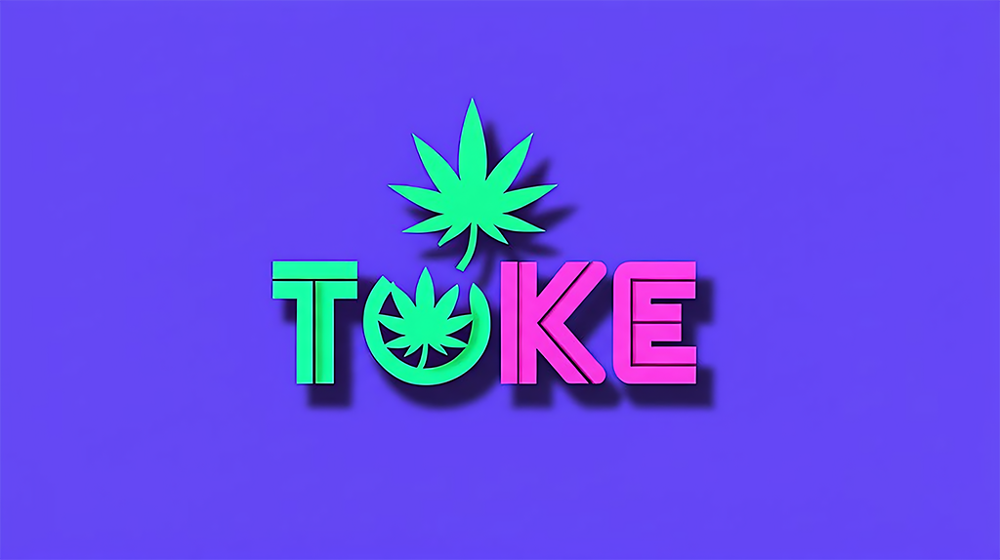

# Toke 🍃

<p align="center">
    <br />
    <a href="https://github.com/chasedut/toke/releases"></a>
    <a href="https://github.com/chasedut/toke/actions"></a>
</p>

<p align="center">Your favorite coding buddy that's always down to smoke some bugs 💨<br />Built with love for the Weedmaps 2025 Hackathon.</p>

<p align="center"></p>

## What's Good? 🔥

Toke is an AI-powered coding assistant with serious weed culture vibes. Fork of Crush, but way more chill.

- **Multi-Model Support:** Choose your strain - Claude Kush, GPT OG, or whatever hits right
- **MLX Support (v0.4202+):** Apple Silicon optimized with GLM-4.5-Air models for that smooth performance
- **Session-Based:** Keep your coding sessions organized like a proper stash box
- **Auto-Versioning:** Each build auto-increments (0.4202 → 0.4203 → ...)
- **Weed Industry Focus:** Built by stoners, for stoners in tech
- **420-Friendly:** Special features at 4:20, because why not?
- **Works Everywhere:** Blazes through macOS, Linux, Windows - we don't discriminate

## Installation 🌿

```bash
# Build from source
git clone https://github.com/chasedut/toke.git
cd toke
make build

# Or install directly with Go
go install github.com/chasedut/toke@latest
```

## Getting Started 💨

```bash
# Light it up
$ toke

# First time? We got you
🍃 Welcome to Toke - Your favorite coding buddy
💨 What's good? Let's build something fire...
```

## Commands That Hit Different 🎯

Once you're in Toke:
- `/roll` - Start a fresh coding session
- `/hit` - Quick code generation 
- `/pack` - Load context from files
- `/strain` - Switch AI models
- `/munchies` - Get code snippets
- `/hydrate` - Clear screen (stay hydrated!)
- `/ash` - Clear conversation
- `/passit` - Share session

## Configuration 🛠️

Toke looks for config in:
1. `.toke.json` (project-specific)
2. `toke.json` 
3. `$HOME/.config/toke/toke.json`

```json
{
  "$schema": "https://weedmaps.com/toke.json",
  "vibe": "sativa",
  "theme": "green-dream",
  "four_twenty_mode": true
}
```

## Weed Industry Features 🏪

Built specifically for weed tech:
- Dispensary API integrations
- Menu management helpers
- Compliance checking
- Delivery route optimization
- Lab test data parsing
- Loyalty program templates

## Contributing 🤝

Pull requests welcome! Let's make Toke the dopest coding assistant out there.

## License 📜

MIT - Do whatever you want with it, just don't bogart the code.

---

Built with 💚 at the Weedmaps 2025 Hackathon

*Stay lifted, code better* 🚀